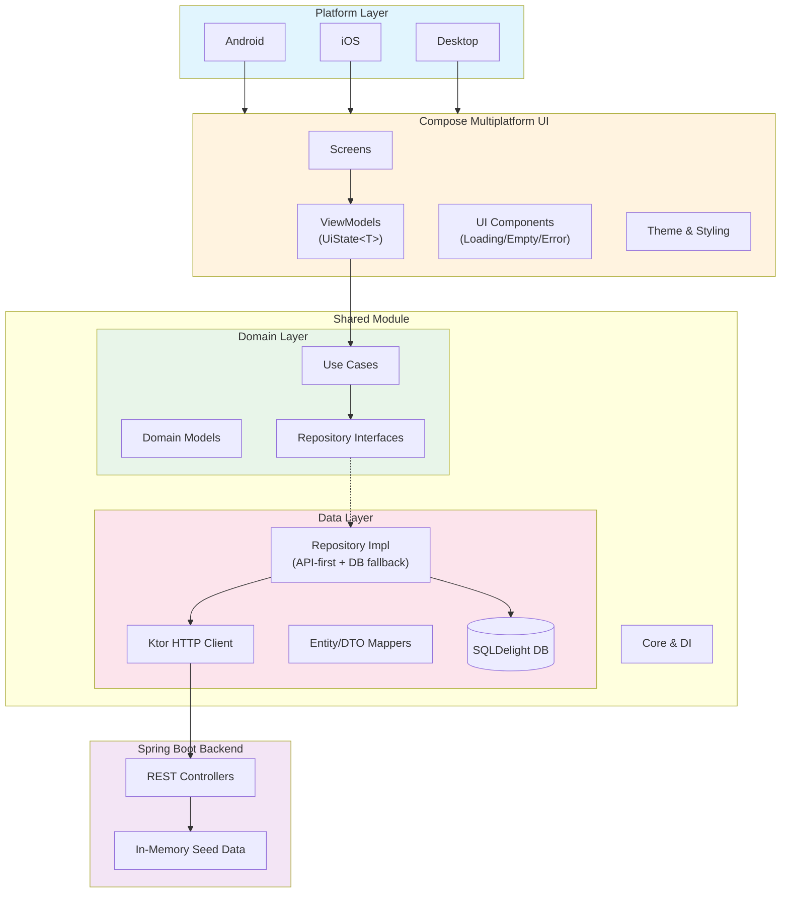
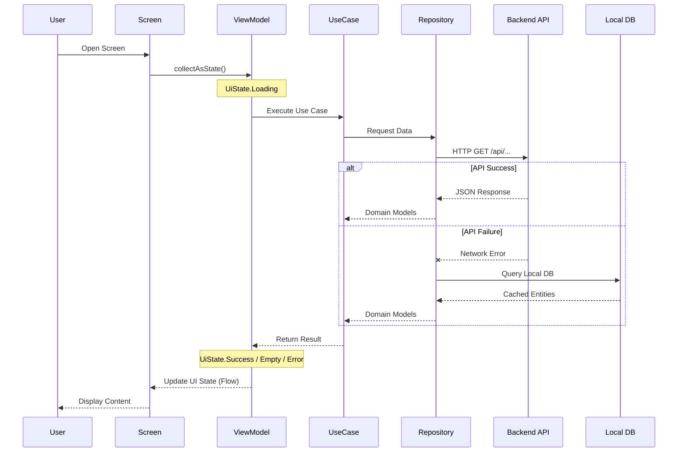
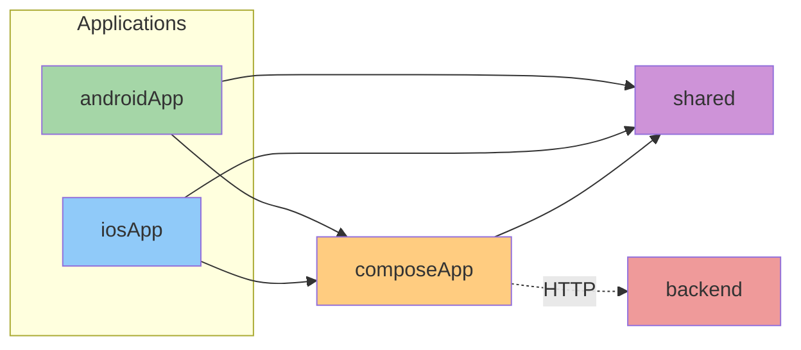
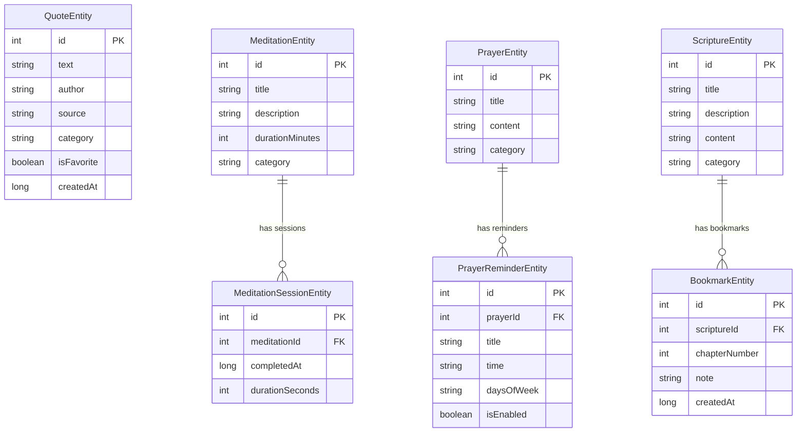
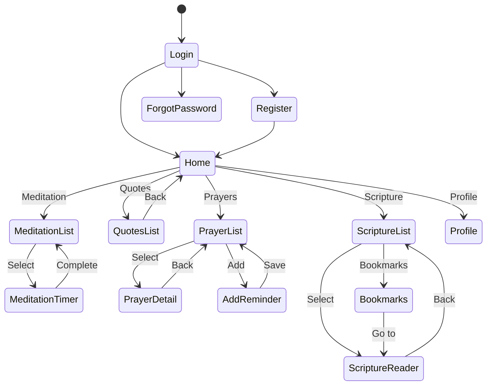
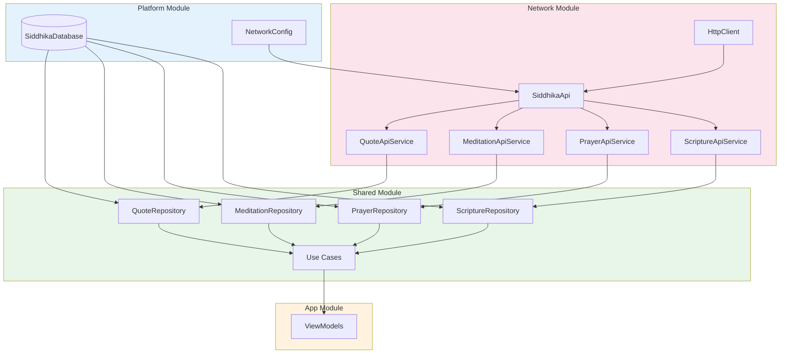

<p align="center">
  
  
  
  
  
</p>

<h1 align="center">Siddhika</h1>

<p align="center">
  <strong>A Cross-Platform Spiritual Wellness Application</strong><br>
  Built with Kotlin Multiplatform, Compose Multiplatform & Spring Boot Backend
</p>

<p align="center">
  <a href="#features">Features</a> &bull;
  <a href="#architecture">Architecture</a> &bull;
  <a href="#tech-stack">Tech Stack</a> &bull;
  <a href="#getting-started">Getting Started</a> &bull;
  <a href="#project-structure">Project Structure</a> &bull;
  <a href="#backend-api">Backend API</a>
</p>

---

## Features

<table>
<tr>
<td width="50%">

### Meditation & Timer
- Guided meditation sessions with countdown timers
- Circular progress animation
- Session tracking and statistics
- Categories: Peace, Mindfulness, Love, Gratitude, Wisdom, Strength

</td>
<td width="50%">

### Daily Quotes
- Inspirational spiritual quotes from the backend API
- Quote of the day on home screen
- Favorite and share functionality
- Categories: Peace, Wisdom, Love, Gratitude, Mindfulness, Strength

</td>
</tr>
<tr>
<td width="50%">

### Prayer Reminders
- Sacred prayers collection served from backend
- Scheduled notification reminders (local)
- Customizable repeat days
- Categories: Peace, Wisdom, Gratitude, Strength, Love, Mindfulness

</td>
<td width="50%">

### Scripture Reader
- Multi-tradition sacred texts (Bhagavad Gita, Psalms, Heart Sutra, etc.)
- Bookmark functionality
- Chapter navigation
- Categories: Hindu, Buddhist, Islamic, Sikh scripture & Psalms

</td>
</tr>
<tr>
<td width="50%">

### Authentication
- Firebase Authentication integration
- Email/password sign-in and registration
- Google and Apple OAuth sign-in
- Profile management and account deletion

</td>
<td width="50%">

### UiState Loading Pattern
- Loading spinner on all screens while data loads
- Empty state with icon and message when no data
- Error state with message and retry button
- Consistent `UiState<T>` sealed interface across all ViewModels

</td>
</tr>
</table>

---

## Architecture

Siddhika follows **Clean Architecture** principles with a client-server model. The mobile/desktop clients consume a REST API backend, with local SQLDelight caching as fallback.

### High-Level Architecture



### Data Flow



### Module Dependencies



### Database Schema



### Navigation Flow



---

## Tech Stack

### Core Technologies

| Category | Technology | Version | Purpose |
|:--------:|:----------:|:-------:|:--------|
| **Language** | Kotlin | 2.0.21 | Primary development language |
| **UI** | Compose Multiplatform | 1.7.0 | Cross-platform UI framework |
| **Navigation** | Voyager | 1.0.0 | Type-safe multiplatform navigation |
| **DI** | Koin | 3.5.6 | Dependency injection |
| **Database** | SQLDelight | 2.0.2 | Type-safe SQL (local cache) |
| **Network** | Ktor Client | 2.3.12 | HTTP client for REST API |
| **Backend** | Spring Boot | 3.2.2 | REST API server |
| **Auth** | Firebase Auth | KMP | Authentication & OAuth |
| **DateTime** | kotlinx-datetime | 0.6.1 | Date/time handling |
| **Async** | Coroutines | 1.8.1 | Asynchronous programming |

### Architecture & Patterns

| Pattern | Implementation | Purpose |
|:-------:|:--------------|:--------|
| **Clean Architecture** | 3-layer separation | Maintainability & testability |
| **MVVM** | ViewModel + StateFlow + UiState | Reactive UI with loading states |
| **Repository** | API-first with local DB fallback | Resilient data access |
| **Use Cases** | Single responsibility | Business logic encapsulation |
| **Observer** | Kotlin Flow | Reactive data streams |
| **UiState** | Sealed interface (Loading/Success/Empty/Error) | Consistent UI state management |

---

## Getting Started

### Prerequisites

- **JDK 17+** - Required for Gradle build
- **Android Studio** - For Android development
- **Xcode 15+** - For iOS development (macOS only)

### Clone Repository

```bash
git clone https://github.com/kundan35/Siddhika.git
cd Siddhika
```

### 1. Start the Backend API

The backend is in a separate repository: [kundan35/siddhika-backend](https://github.com/kundan35/siddhika-backend)

```bash
git clone https://github.com/kundan35/siddhika-backend.git
cd siddhika-backend
./gradlew bootRun
```

The backend starts on `http://localhost:8080` and serves quotes, meditations, prayers, and scriptures.

### 2. Run Desktop App

```bash
./gradlew :composeApp:run
```

### 3. Build & Install Android App

```bash
# Build APK
./gradlew :androidApp:assembleDebug

# Install on connected device
./gradlew :androidApp:installDebug
```

> **Note:** For a physical Android device, update the base URL in
> `shared/src/androidMain/kotlin/com/siddhika/core/di/NetworkConfig.kt`
> to your machine's local IP address (e.g. `http://192.168.1.2:8080`).
> The device must be on the same network as the backend server.

### 4. Run iOS App

```bash
open iosApp/iosApp.xcodeproj
# Run on simulator or device from Xcode
```

### Verification

| Step | Expected Behavior |
|------|-------------------|
| Backend running + app open | Loading spinner briefly, then data appears |
| Backend stopped + app open | Loading spinner, then empty/error state with retry button |
| Tap "Retry" after starting backend | Data loads successfully |

---

## Backend API

The Spring Boot backend lives in a separate repository: [kundan35/siddhika-backend](https://github.com/kundan35/siddhika-backend)

It serves spiritual content via REST endpoints. Data is held in-memory from seed data.

### Endpoints

| Method | Endpoint | Description |
|:------:|:---------|:------------|
| `GET` | `/api/quotes` | All quotes |
| `GET` | `/api/quotes/{id}` | Quote by ID |
| `GET` | `/api/quotes/category/{category}` | Quotes by category |
| `GET` | `/api/meditations` | All meditations |
| `GET` | `/api/meditations/{id}` | Meditation by ID |
| `GET` | `/api/meditations/category/{category}` | Meditations by category |
| `GET` | `/api/prayers` | All prayers |
| `GET` | `/api/prayers/{id}` | Prayer by ID |
| `GET` | `/api/prayers/category/{category}` | Prayers by category |
| `GET` | `/api/scriptures` | All scriptures |
| `GET` | `/api/scriptures/{id}` | Scripture by ID |
| `GET` | `/api/scriptures/category/{category}` | Scriptures by category |

### Example Response

```bash
curl http://localhost:8080/api/quotes/1
```

```json
{
  "id": 1,
  "text": "Peace comes from within. Do not seek it without.",
  "author": "Buddha",
  "source": "Dhammapada",
  "category": "peace",
  "isFavorite": false,
  "createdAt": 1706400000000
}
```

### Content Summary

| Type | Count | Categories |
|------|:-----:|:-----------|
| Quotes | 15 | peace, wisdom, love, gratitude, mindfulness, strength |
| Meditations | 8 | peace, mindfulness, love, gratitude, wisdom, strength |
| Prayers | 7 | peace, wisdom, gratitude, strength, love, mindfulness |
| Scriptures | 5 | hindu_scripture, psalm, buddhist_scripture, islamic_scripture, sikh_scripture |

---

## Project Structure

```
Siddhika/
|
+-- androidApp/                    # Android Application Entry Point
|   +-- src/main/
|       +-- AndroidManifest.xml
|       +-- kotlin/.../
|           +-- MainActivity.kt
|           +-- SiddhikaApplication.kt
|           +-- notification/
|
+-- iosApp/                        # iOS Application Entry Point
|   +-- iosApp/
|       +-- iOSApp.swift
|       +-- ContentView.swift
|       +-- Info.plist
|
+-- composeApp/                    # Compose Multiplatform UI
|   +-- src/
|       +-- commonMain/kotlin/com/siddhika/
|       |   +-- App.kt
|       |   +-- di/AppModule.kt
|       |   +-- ui/
|       |       +-- theme/           # Colors, Typography, Theme
|       |       +-- components/      # Reusable UI components
|       |       |   +-- StateComponents.kt  # Loading/Empty/Error
|       |       |   +-- QuoteCard.kt
|       |       |   +-- FeatureCards.kt
|       |       |   +-- TimerCircle.kt
|       |       |   +-- ...
|       |       +-- screens/         # Feature screens
|       |       |   +-- home/
|       |       |   +-- meditation/
|       |       |   +-- quotes/
|       |       |   +-- prayers/
|       |       |   +-- scripture/
|       |       |   +-- auth/
|       |       +-- auth/            # Platform auth handlers
|       +-- androidMain/
|       +-- iosMain/
|       +-- desktopMain/
|
+-- shared/                        # Shared Business Logic
|   +-- src/
|       +-- commonMain/kotlin/com/siddhika/
|       |   +-- domain/              # Domain Layer
|       |   |   +-- model/          # Business entities
|       |   |   +-- repository/     # Repository interfaces
|       |   |   +-- usecase/        # Business logic
|       |   +-- data/                # Data Layer
|       |   |   +-- local/database/ # SQLDelight (local cache)
|       |   |   +-- remote/         # Ktor API services & DTOs
|       |   |   |   +-- api/        # QuoteApiService, etc.
|       |   |   |   +-- dto/        # QuoteDto, etc.
|       |   |   |   +-- mapper/     # DTO -> Domain mappers
|       |   |   +-- repository/     # API-first implementations
|       |   |   +-- mapper/         # Entity -> Domain mappers
|       |   |   +-- auth/           # Firebase auth service
|       |   +-- core/                # Core utilities
|       |       +-- di/             # Koin modules + NetworkConfig
|       |       +-- util/           # UiState, Result, Constants
|       +-- androidMain/             # Android: DB driver, network, auth
|       +-- iosMain/                 # iOS: DB driver, network, auth
|       +-- desktopMain/             # Desktop: DB driver, network
|
+-- gradle/
    +-- libs.versions.toml           # Version catalog
```

---

## Design System

### Color Palette

The app uses a spiritual theme inspired by traditional sacred colors:

| Color | Hex | Usage |
|:------|:---:|:------|
| **Saffron** | `#FF9933` | Primary - Sacred saffron |
| **Gold** | `#FFD700` | Accent - Divine gold |
| **Maroon** | `#800000` | Secondary - Sacred maroon |
| **Sage** | `#9DC183` | Nature - Peace & harmony |
| **Midnight** | `#191970` | Dark - Meditation depth |
| **Cream** | `#FFF8DC` | Background - Peaceful cream |

### Typography

- **Display**: Meditation timer, headlines
- **Title**: Section headers, card titles
- **Body**: Content, descriptions
- **Label**: Categories, timestamps

---

## Dependency Injection



---

## License

```
MIT License

Copyright (c) 2026 Kundan Kumar

Permission is hereby granted, free of charge, to any person obtaining a copy
of this software and associated documentation files (the "Software"), to deal
in the Software without restriction, including without limitation the rights
to use, copy, modify, merge, publish, distribute, sublicense, and/or sell
copies of the Software, and to permit persons to whom the Software is
furnished to do so, subject to the following conditions:

The above copyright notice and this permission notice shall be included in all
copies or substantial portions of the Software.

THE SOFTWARE IS PROVIDED "AS IS", WITHOUT WARRANTY OF ANY KIND, EXPRESS OR
IMPLIED, INCLUDING BUT NOT LIMITED TO THE WARRANTIES OF MERCHANTABILITY,
FITNESS FOR A PARTICULAR PURPOSE AND NONINFRINGEMENT.
```

---

<p align="center">
  Made with care
</p>

<p align="center">
  <a href="https://github.com/kundan35/Siddhika/stargazers">Star this repo</a> &bull;
  <a href="https://github.com/kundan35/Siddhika/issues">Report Bug</a> &bull;
  <a href="https://github.com/kundan35/Siddhika/issues">Request Feature</a>
</p>
