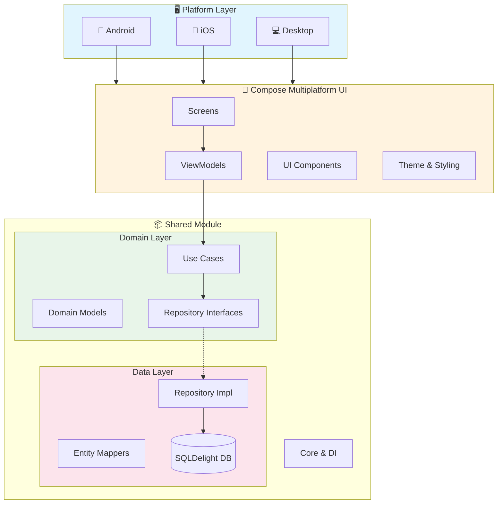
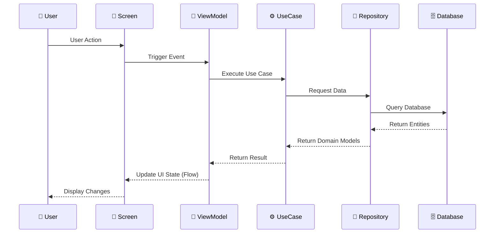
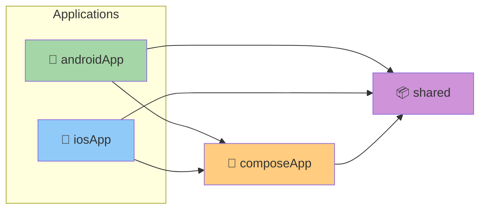
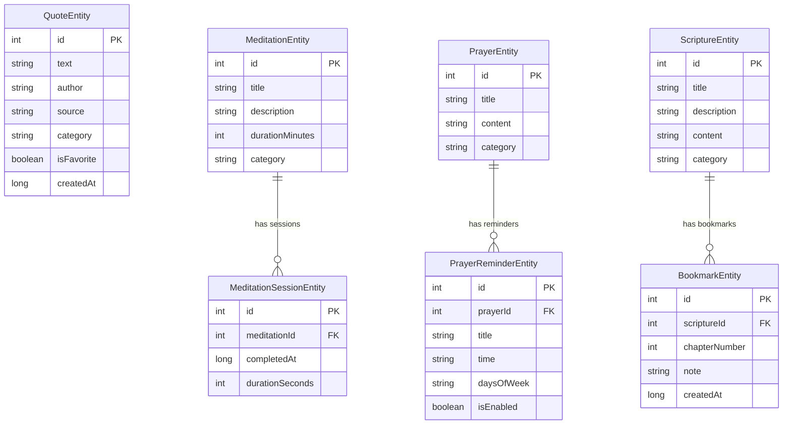
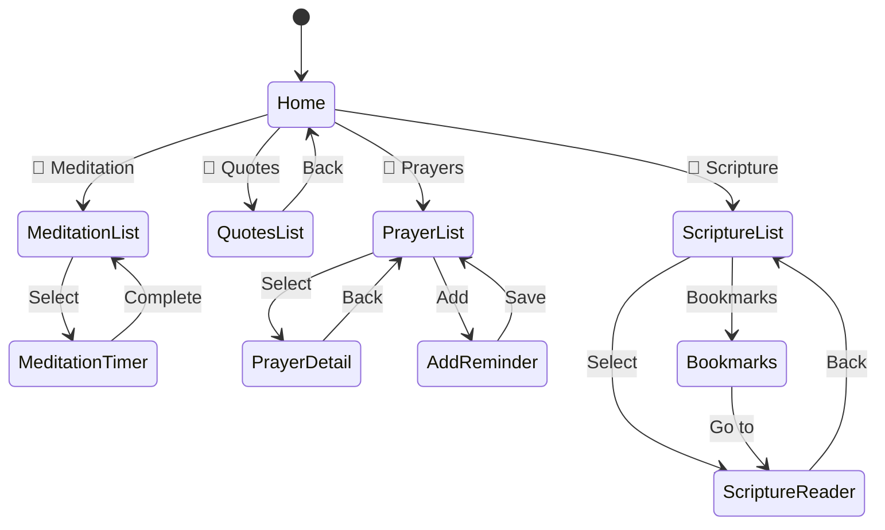
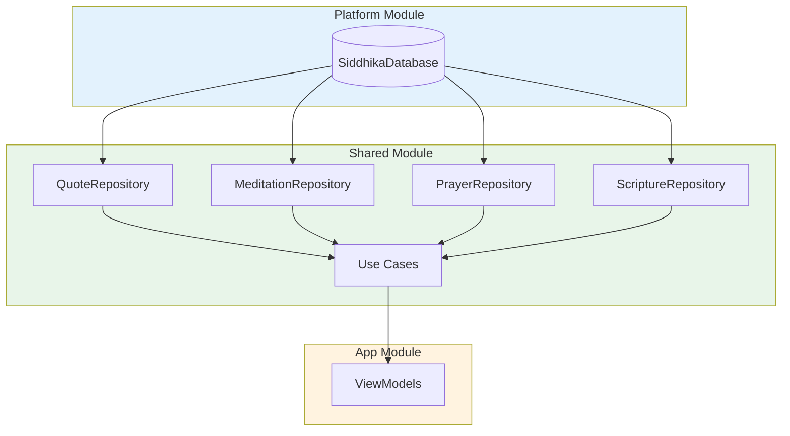

<p align="center">
  
  
  
  
</p>

<h1 align="center">🙏 Siddhika</h1>

<p align="center">
  <strong>A Cross-Platform Spiritual Wellness Application</strong><br>
  Built with Kotlin Multiplatform & Compose Multiplatform
</p>

<p align="center">
  <a href="#features">Features</a> •
  <a href="#architecture">Architecture</a> •
  <a href="#tech-stack">Tech Stack</a> •
  <a href="#getting-started">Getting Started</a> •
  <a href="#project-structure">Project Structure</a>
</p>

---

## ✨ Features

<table>
<tr>
<td width="50%">

### 🧘 Meditation & Timer
- Guided meditation sessions with countdown timers
- Beautiful circular progress animation
- Session tracking and statistics
- Categories: Breathing, Guided, Sleep, Focus, Relaxation, Morning

</td>
<td width="50%">

### 📿 Daily Quotes & Mantras
- Inspirational spiritual quotes
- Quote of the day on home screen
- Favorite and share functionality
- Categories: Peace, Wisdom, Love, Gratitude, Mindfulness

</td>
</tr>
<tr>
<td width="50%">

### 🔔 Prayer Reminders
- Sacred prayers collection
- Scheduled notification reminders
- Customizable repeat days
- Categories: Morning, Evening, Gratitude, Healing, Protection

</td>
<td width="50%">

### 📖 Scripture Reader
- Read sacred texts (Bhagavad Gita, Yoga Sutras, Upanishads)
- Bookmark functionality
- Chapter navigation
- Sanskrit with translations

</td>
</tr>
</table>

---

## 🏗️ Architecture

Siddhika follows **Clean Architecture** principles with clear separation of concerns across Presentation, Domain, and Data layers.

### High-Level Architecture



### Data Flow



### Module Dependencies



### Database Schema



### Navigation Flow



---

## 🛠️ Tech Stack

### Core Technologies

| Category | Technology | Version | Purpose |
|:--------:|:----------:|:-------:|:--------|
| 🔷 **Language** | Kotlin | 2.0.21 | Primary development language |
| 🎨 **UI** | Compose Multiplatform | 1.7.0 | Cross-platform UI framework |
| 🧭 **Navigation** | Voyager | 1.0.0 | Type-safe multiplatform navigation |
| 💉 **DI** | Koin | 3.5.6 | Dependency injection |
| 🗄️ **Database** | SQLDelight | 2.0.2 | Type-safe SQL |
| ⏰ **DateTime** | kotlinx-datetime | 0.6.1 | Date/time handling |
| 📡 **Network** | Ktor | 2.3.12 | HTTP client (future) |
| 🔄 **Async** | Coroutines | 1.8.1 | Asynchronous programming |

### Architecture & Patterns

| Pattern | Implementation | Purpose |
|:-------:|:--------------|:--------|
| 🏛️ **Clean Architecture** | 3-layer separation | Maintainability & testability |
| 📊 **MVVM** | ViewModel + StateFlow | Reactive UI management |
| 📦 **Repository** | Interface + Impl | Data source abstraction |
| ⚙️ **Use Cases** | Single responsibility | Business logic encapsulation |
| 🔄 **Observer** | Kotlin Flow | Reactive data streams |

---

## 🚀 Getting Started

### Prerequisites

- **JDK 17+** - Required for Gradle build
- **Android Studio** - For Android development
- **Xcode 15+** - For iOS development (macOS only)

### Clone Repository

```bash
git clone https://github.com/kundan35/Siddhika.git
cd Siddhika
```

### Run Desktop App

```bash
./gradlew :composeApp:run
```

### Build Android APK

```bash
./gradlew :androidApp:assembleDebug
```

### Install on Android Device

```bash
./gradlew :androidApp:installDebug
```

### Run iOS App

```bash
# Open in Xcode
open iosApp/iosApp.xcodeproj
# Then run on simulator or device from Xcode
```

---

## 📁 Project Structure

```
Siddhika/
│
├── 📱 androidApp/                    # Android Application Entry Point
│   └── src/main/
│       ├── AndroidManifest.xml
│       └── kotlin/.../
│           ├── MainActivity.kt
│           ├── SiddhikaApplication.kt
│           └── notification/
│
├── 🍎 iosApp/                        # iOS Application Entry Point
│   └── iosApp/
│       ├── iOSApp.swift
│       ├── ContentView.swift
│       └── Info.plist
│
├── 🎨 composeApp/                    # Compose Multiplatform UI
│   └── src/
│       ├── commonMain/kotlin/com/siddhika/
│       │   ├── App.kt
│       │   ├── di/AppModule.kt
│       │   └── ui/
│       │       ├── theme/           # Colors, Typography, Theme
│       │       ├── components/      # Reusable UI components
│       │       └── screens/         # Feature screens
│       │           ├── home/
│       │           ├── meditation/
│       │           ├── quotes/
│       │           ├── prayers/
│       │           └── scripture/
│       ├── androidMain/
│       ├── iosMain/
│       └── desktopMain/
│
├── 📦 shared/                        # Shared Business Logic
│   └── src/
│       ├── commonMain/kotlin/com/siddhika/
│       │   ├── domain/              # Domain Layer
│       │   │   ├── model/          # Business entities
│       │   │   ├── repository/     # Repository interfaces
│       │   │   └── usecase/        # Business logic
│       │   ├── data/                # Data Layer
│       │   │   ├── local/database/ # SQLDelight
│       │   │   ├── repository/     # Implementations
│       │   │   └── mapper/         # Entity mappers
│       │   └── core/                # Core utilities
│       │       ├── di/             # Koin modules
│       │       └── util/           # Helpers
│       ├── androidMain/             # Android implementations
│       ├── iosMain/                 # iOS implementations
│       └── desktopMain/             # Desktop implementations
│
└── 🔧 gradle/
    └── libs.versions.toml           # Version catalog
```

---

## 🎨 Design System

### Color Palette

The app uses a **spiritual theme** inspired by traditional sacred colors:

| Color | Hex | Usage |
|:------|:---:|:------|
| 🟠 **Saffron** | `#FF9933` | Primary - Sacred saffron |
| 🟡 **Gold** | `#FFD700` | Accent - Divine gold |
| 🟤 **Maroon** | `#800000` | Secondary - Sacred maroon |
| 🟢 **Sage** | `#9DC183` | Nature - Peace & harmony |
| 🔵 **Midnight** | `#191970` | Dark - Meditation depth |
| ⚪ **Cream** | `#FFF8DC` | Background - Peaceful cream |

### Typography

- **Display**: Meditation timer, headlines
- **Title**: Section headers, card titles
- **Body**: Content, descriptions
- **Label**: Categories, timestamps

---

## 📊 Dependency Injection



---

## 📄 License

```
MIT License

Copyright (c) 2026 Kundan Kumar

Permission is hereby granted, free of charge, to any person obtaining a copy
of this software and associated documentation files (the "Software"), to deal
in the Software without restriction, including without limitation the rights
to use, copy, modify, merge, publish, distribute, sublicense, and/or sell
copies of the Software, and to permit persons to whom the Software is
furnished to do so, subject to the following conditions:

The above copyright notice and this permission notice shall be included in all
copies or substantial portions of the Software.

THE SOFTWARE IS PROVIDED "AS IS", WITHOUT WARRANTY OF ANY KIND, EXPRESS OR
IMPLIED, INCLUDING BUT NOT LIMITED TO THE WARRANTIES OF MERCHANTABILITY,
FITNESS FOR A PARTICULAR PURPOSE AND NONINFRINGEMENT.
```

---

<p align="center">
  Made with ❤️ and 🙏
</p>

<p align="center">
  <a href="https://github.com/kundan35/Siddhika/stargazers">⭐ Star this repo</a> •
  <a href="https://github.com/kundan35/Siddhika/issues">🐛 Report Bug</a> •
  <a href="https://github.com/kundan35/Siddhika/issues">✨ Request Feature</a>
</p>
