<p align="center">
  
  
  
  
</p>

<h1 align="center">🙏 Siddhika</h1>

<p align="center">
  <strong>A Cross-Platform Spiritual Wellness Application</strong><br>
  Built with Kotlin Multiplatform & Compose Multiplatform
</p>

<p align="center">
  <a href="#features">Features</a> •
  <a href="#architecture">Architecture</a> •
  <a href="#tech-stack">Tech Stack</a> •
  <a href="#getting-started">Getting Started</a> •
  <a href="#project-structure">Project Structure</a>
</p>

---

## ✨ Features

<table>
<tr>
<td width="50%">

### 🧘 Meditation & Timer
- Guided meditation sessions with countdown timers
- Beautiful circular progress animation
- Session tracking and statistics
- Categories: Breathing, Guided, Sleep, Focus, Relaxation, Morning

</td>
<td width="50%">

### 📿 Daily Quotes & Mantras
- Inspirational spiritual quotes
- Quote of the day on home screen
- Favorite and share functionality
- Categories: Peace, Wisdom, Love, Gratitude, Mindfulness

</td>
</tr>
<tr>
<td width="50%">

### 🔔 Prayer Reminders
- Sacred prayers collection
- Scheduled notification reminders
- Customizable repeat days
- Categories: Morning, Evening, Gratitude, Healing, Protection

</td>
<td width="50%">

### 📖 Scripture Reader
- Read sacred texts (Bhagavad Gita, Yoga Sutras, Upanishads)
- Bookmark functionality
- Chapter navigation
- Sanskrit with translations

</td>
</tr>
</table>

---

## 🎬 Demo

<table>
<tr>
<td width="33%" align="center">

### 📱 Android

<!--
To add Android demo:
1. Record your screen using Android Studio or scrcpy
2. Convert to GIF using: ffmpeg -i video.mp4 -vf "fps=15,scale=280:-1" android-demo.gif
3. Add the GIF to /docs/demos/ folder
4. Replace the placeholder below with: 
-->

<p align="center">
  
</p>

<details>
<summary>📋 How to add demo</summary>

```bash
# Record using scrcpy
scrcpy --record android-demo.mp4

# Convert to GIF
ffmpeg -i android-demo.mp4 \
  -vf "fps=15,scale=280:-1:flags=lanczos" \
  -c:v gif docs/demos/android-demo.gif
```

</details>

</td>
<td width="33%" align="center">

### 🍎 iOS

<!--
To add iOS demo:
1. Record simulator: xcrun simctl io booted recordVideo ios-demo.mp4
2. Or use QuickTime Player to record device
3. Convert to GIF and add to /docs/demos/
4. Replace the placeholder below
-->

<p align="center">
  
</p>

<details>
<summary>📋 How to add demo</summary>

```bash
# Record iOS Simulator
xcrun simctl io booted recordVideo ios-demo.mp4

# Convert to GIF
ffmpeg -i ios-demo.mp4 \
  -vf "fps=15,scale=280:-1:flags=lanczos" \
  -c:v gif docs/demos/ios-demo.gif
```

</details>

</td>
<td width="33%" align="center">

### 💻 Desktop

<!--
To add Desktop demo:
1. Use screen recording software (OBS, QuickTime, etc.)
2. Convert to GIF
3. Add to /docs/demos/
4. Replace the placeholder below
-->

<p align="center">
  
</p>

<details>
<summary>📋 How to add demo</summary>

```bash
# Record using ffmpeg (macOS)
ffmpeg -f avfoundation -i "1" -t 30 desktop-demo.mp4

# Convert to GIF
ffmpeg -i desktop-demo.mp4 \
  -vf "fps=15,scale=400:-1:flags=lanczos" \
  -c:v gif docs/demos/desktop-demo.gif
```

</details>

</td>
</tr>
</table>

### 📸 Screenshots

<table>
<tr>
<td align="center">
<strong>🏠 Home</strong><br>

</td>
<td align="center">
<strong>🧘 Meditation</strong><br>

</td>
<td align="center">
<strong>⏱️ Timer</strong><br>

</td>
<td align="center">
<strong>📿 Quotes</strong><br>

</td>
</tr>
<tr>
<td align="center">
<strong>🔔 Prayers</strong><br>

</td>
<td align="center">
<strong>⏰ Reminders</strong><br>

</td>
<td align="center">
<strong>📖 Scripture</strong><br>

</td>
<td align="center">
<strong>📑 Reader</strong><br>

</td>
</tr>
</table>

<details>
<summary>📋 How to add real screenshots</summary>

1. **Take screenshots** on each platform
2. **Create folder**: `mkdir -p docs/screenshots`
3. **Add images** to the folder
4. **Update README** - replace placeholder URLs with:
   ```markdown
   
   
   ```

**Recommended sizes:**
- Mobile: 1080x1920 or 1170x2532
- Desktop: 1920x1080

**Tools:**
- Android: `adb exec-out screencap -p > screenshot.png`
- iOS: `xcrun simctl io booted screenshot screenshot.png`
- Desktop: System screenshot tool

</details>

---

## 🏗️ Architecture

Siddhika follows **Clean Architecture** principles with clear separation of concerns across Presentation, Domain, and Data layers.

### High-Level Architecture

```mermaid
graph TB
    subgraph Platform["🖥️ Platform Layer"]
        Android["📱 Android"]
        iOS["🍎 iOS"]
        Desktop["💻 Desktop"]
    end

    subgraph UI["🎨 Compose Multiplatform UI"]
        Screens["Screens"]
        ViewModels["ViewModels"]
        Components["UI Components"]
        Theme["Theme & Styling"]
    end

    subgraph Shared["📦 Shared Module"]
        subgraph Domain["Domain Layer"]
            Models["Domain Models"]
            RepoInterfaces["Repository Interfaces"]
            UseCases["Use Cases"]
        end

        subgraph Data["Data Layer"]
            RepoImpl["Repository Impl"]
            Mappers["Entity Mappers"]
            LocalDB[("SQLDelight DB")]
        end

        Core["Core & DI"]
    end

    Android --> UI
    iOS --> UI
    Desktop --> UI

    Screens --> ViewModels
    ViewModels --> UseCases
    UseCases --> RepoInterfaces
    RepoInterfaces -.-> RepoImpl
    RepoImpl --> LocalDB

    style Platform fill:#e1f5fe
    style UI fill:#fff3e0
    style Domain fill:#e8f5e9
    style Data fill:#fce4ec
```



### Data Flow

```mermaid
sequenceDiagram
    participant U as 👤 User
    participant S as 📱 Screen
    participant VM as 🧠 ViewModel
    participant UC as ⚙️ UseCase
    participant R as 📂 Repository
    participant DB as 🗄️ Database

    U->>S: User Action
    S->>VM: Trigger Event
    VM->>UC: Execute Use Case
    UC->>R: Request Data
    R->>DB: Query Database
    DB-->>R: Return Entities
    R-->>UC: Return Domain Models
    UC-->>VM: Return Result
    VM-->>S: Update UI State (Flow)
    S-->>U: Display Changes
```



### Module Dependencies

```mermaid
graph LR
    subgraph Apps["Applications"]
        A["📱 androidApp"]
        I["🍎 iosApp"]
    end

    C["🎨 composeApp"]
    S["📦 shared"]

    A --> C
    A --> S
    I --> C
    I --> S
    C --> S

    style A fill:#a5d6a7
    style I fill:#90caf9
    style C fill:#ffcc80
    style S fill:#ce93d8
```



### Database Schema


### Navigation Flow


---

## 🛠️ Tech Stack

### Core Technologies

| Category | Technology | Version | Purpose |
|:--------:|:----------:|:-------:|:--------|
| 🔷 **Language** | Kotlin | 2.0.21 | Primary development language |
| 🎨 **UI** | Compose Multiplatform | 1.7.0 | Cross-platform UI framework |
| 🧭 **Navigation** | Voyager | 1.0.0 | Type-safe multiplatform navigation |
| 💉 **DI** | Koin | 3.5.6 | Dependency injection |
| 🗄️ **Database** | SQLDelight | 2.0.2 | Type-safe SQL |
| ⏰ **DateTime** | kotlinx-datetime | 0.6.1 | Date/time handling |
| 📡 **Network** | Ktor | 2.3.12 | HTTP client (future) |
| 🔄 **Async** | Coroutines | 1.8.1 | Asynchronous programming |

### Architecture & Patterns

| Pattern | Implementation | Purpose |
|:-------:|:--------------|:--------|
| 🏛️ **Clean Architecture** | 3-layer separation | Maintainability & testability |
| 📊 **MVVM** | ViewModel + StateFlow | Reactive UI management |
| 📦 **Repository** | Interface + Impl | Data source abstraction |
| ⚙️ **Use Cases** | Single responsibility | Business logic encapsulation |
| 🔄 **Observer** | Kotlin Flow | Reactive data streams |

---

## 🚀 Getting Started

### Prerequisites

- **JDK 17+** - Required for Gradle build
- **Android Studio** - For Android development
- **Xcode 15+** - For iOS development (macOS only)

### Clone Repository

```bash
git clone https://github.com/kundan35/Siddhika.git
cd Siddhika
```

### Run Desktop App

```bash
./gradlew :composeApp:run
```

### Build Android APK

```bash
./gradlew :androidApp:assembleDebug
```

### Install on Android Device

```bash
./gradlew :androidApp:installDebug
```

### Run iOS App

```bash
# Open in Xcode
open iosApp/iosApp.xcodeproj
# Then run on simulator or device from Xcode
```

---

## 📁 Project Structure

```
Siddhika/
│
├── 📱 androidApp/                    # Android Application Entry Point
│   └── src/main/
│       ├── AndroidManifest.xml
│       └── kotlin/.../
│           ├── MainActivity.kt
│           ├── SiddhikaApplication.kt
│           └── notification/
│
├── 🍎 iosApp/                        # iOS Application Entry Point
│   └── iosApp/
│       ├── iOSApp.swift
│       ├── ContentView.swift
│       └── Info.plist
│
├── 🎨 composeApp/                    # Compose Multiplatform UI
│   └── src/
│       ├── commonMain/kotlin/com/siddhika/
│       │   ├── App.kt
│       │   ├── di/AppModule.kt
│       │   └── ui/
│       │       ├── theme/           # Colors, Typography, Theme
│       │       ├── components/      # Reusable UI components
│       │       └── screens/         # Feature screens
│       │           ├── home/
│       │           ├── meditation/
│       │           ├── quotes/
│       │           ├── prayers/
│       │           └── scripture/
│       ├── androidMain/
│       ├── iosMain/
│       └── desktopMain/
│
├── 📦 shared/                        # Shared Business Logic
│   └── src/
│       ├── commonMain/kotlin/com/siddhika/
│       │   ├── domain/              # Domain Layer
│       │   │   ├── model/          # Business entities
│       │   │   ├── repository/     # Repository interfaces
│       │   │   └── usecase/        # Business logic
│       │   ├── data/                # Data Layer
│       │   │   ├── local/database/ # SQLDelight
│       │   │   ├── repository/     # Implementations
│       │   │   └── mapper/         # Entity mappers
│       │   └── core/                # Core utilities
│       │       ├── di/             # Koin modules
│       │       └── util/           # Helpers
│       ├── androidMain/             # Android implementations
│       ├── iosMain/                 # iOS implementations
│       └── desktopMain/             # Desktop implementations
│
└── 🔧 gradle/
    └── libs.versions.toml           # Version catalog
```

---

## 🎨 Design System

### Color Palette

The app uses a **spiritual theme** inspired by traditional sacred colors:

| Color | Hex | Usage |
|:------|:---:|:------|
| 🟠 **Saffron** | `#FF9933` | Primary - Sacred saffron |
| 🟡 **Gold** | `#FFD700` | Accent - Divine gold |
| 🟤 **Maroon** | `#800000` | Secondary - Sacred maroon |
| 🟢 **Sage** | `#9DC183` | Nature - Peace & harmony |
| 🔵 **Midnight** | `#191970` | Dark - Meditation depth |
| ⚪ **Cream** | `#FFF8DC` | Background - Peaceful cream |

### Typography

- **Display**: Meditation timer, headlines
- **Title**: Section headers, card titles
- **Body**: Content, descriptions
- **Label**: Categories, timestamps

---

## 📊 Dependency Injection


---

## 📄 License

```
MIT License

Copyright (c) 2026 Kundan Kumar

Permission is hereby granted, free of charge, to any person obtaining a copy
of this software and associated documentation files (the "Software"), to deal
in the Software without restriction, including without limitation the rights
to use, copy, modify, merge, publish, distribute, sublicense, and/or sell
copies of the Software, and to permit persons to whom the Software is
furnished to do so, subject to the following conditions:

The above copyright notice and this permission notice shall be included in all
copies or substantial portions of the Software.

THE SOFTWARE IS PROVIDED "AS IS", WITHOUT WARRANTY OF ANY KIND, EXPRESS OR
IMPLIED, INCLUDING BUT NOT LIMITED TO THE WARRANTIES OF MERCHANTABILITY,
FITNESS FOR A PARTICULAR PURPOSE AND NONINFRINGEMENT.
```

---

<p align="center">
  Made with ❤️ and 🙏
</p>

<p align="center">
  <a href="https://github.com/kundan35/Siddhika/stargazers">⭐ Star this repo</a> •
  <a href="https://github.com/kundan35/Siddhika/issues">🐛 Report Bug</a> •
  <a href="https://github.com/kundan35/Siddhika/issues">✨ Request Feature</a>
</p>
