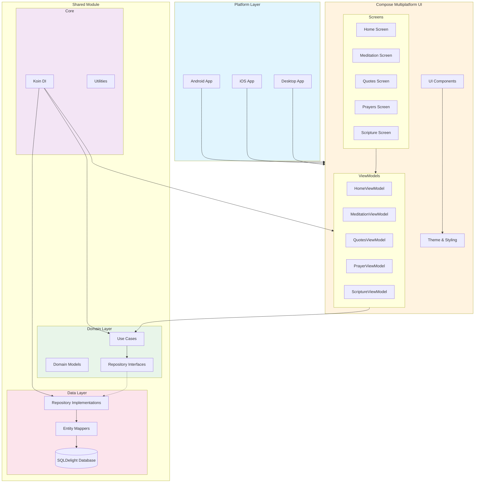
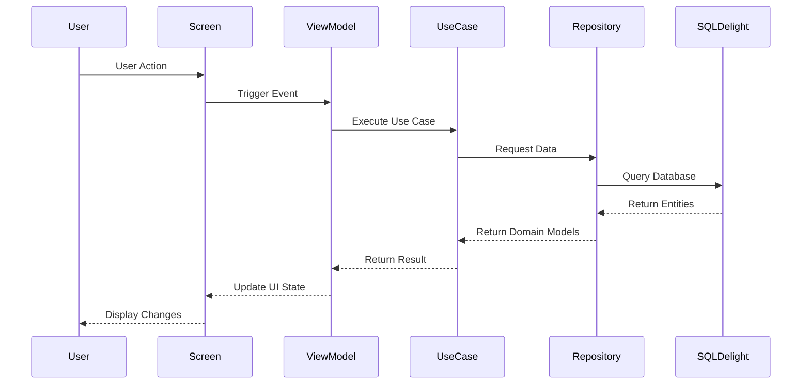
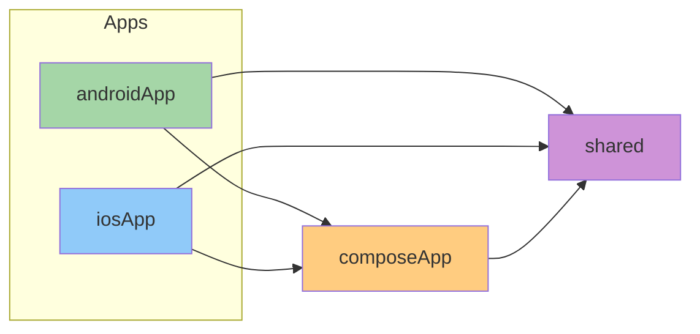
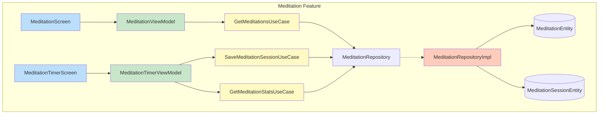
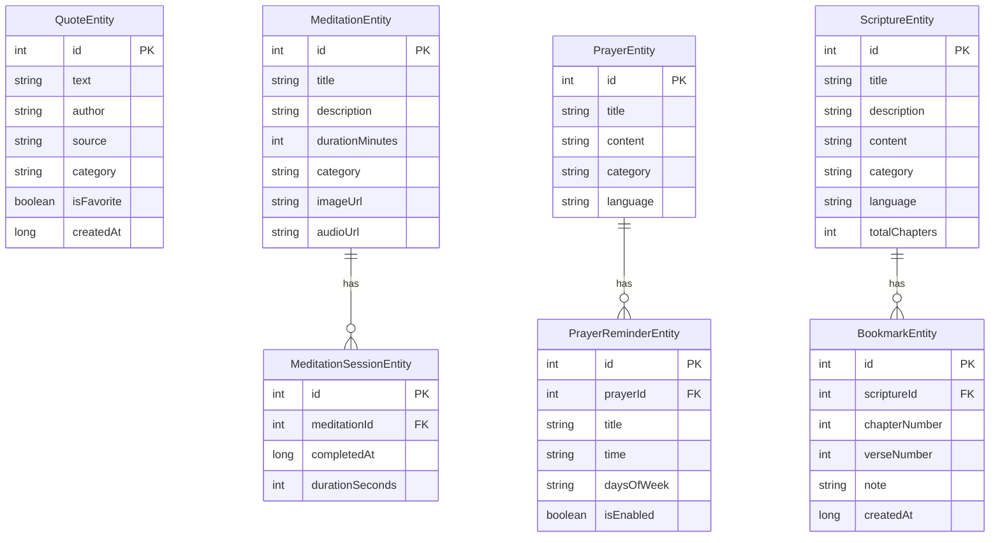
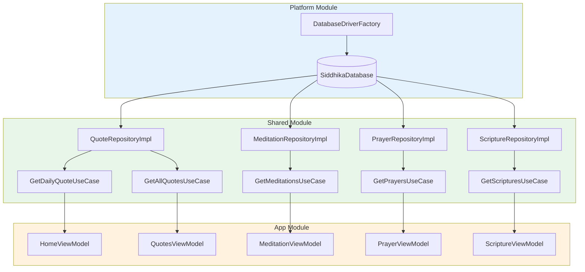
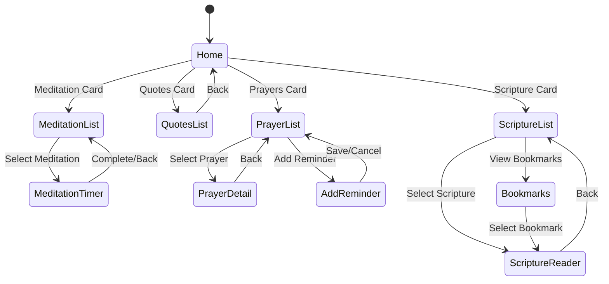
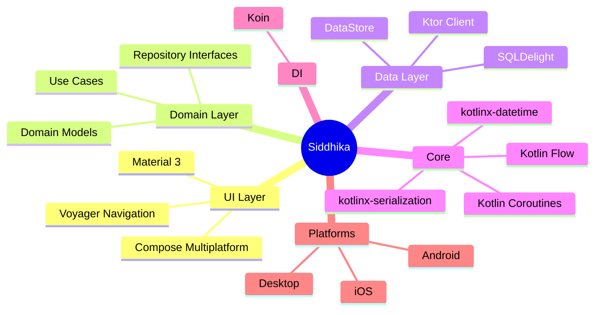

# Siddhika - Visual Diagrams

## High-Level Architecture

## Data Flow

## Module Dependencies

## Feature Module Structure

## Database Entity Relationships

## Dependency Injection Graph

## Navigation Flow

## Technology Stack

